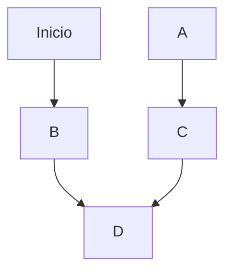

# Desarrollo Seguro

* Normativas para los equipos (forntend y backend)
* Revisiones de pares.
* Herramientas de analisis estatico (SonarQube) SAST
* Herramientas de analisis dinamico (OWASP ZAP, MOBSF) DAST
* Hacking etico (de terceros)

